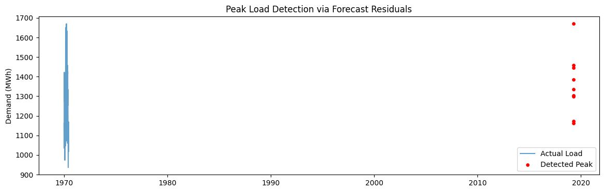

# Feeder Demand Forecasting & Peak Load Detection

## 📌 Project Overview
This project implements a **short-term (24–72 hour) electricity demand forecasting model** along with a **peak/anomaly detection module** for distribution systems.

Due to confidentiality of feeder-level data, **national electricity demand data from Panama** is used as a proxy. The methodology is directly applicable to feeder-level forecasting used by utilities for operational planning and overload prevention.

---

## 📊 Results & Outputs

This section summarizes the key results of the project using saved plots and metrics generated from the analysis notebooks.
All outputs are stored in the `outputs/` directory for easy review and reproducibility.

### 🔹 Exploratory Data Analysis
Saved plots:
- `outputs/plots/hourly_load_profile.png`
- `outputs/plots/average_hourly_demand.png`
- `outputs/plots/peak_load_visualization.png`

These plots highlight daily and weekly demand patterns and statistically defined peak events.

### 🔹 Short-Term Load Forecasting (24–72h)


Saved metrics:
- `outputs/metrics/forecast_metrics.csv`

Metrics reported:
- Mean Absolute Error (MAE)
- Root Mean Square Error (RMSE)

### 🔹 Peak Load & Anomaly Detection



Saved metrics:
- `outputs/metrics/peak_detection_summary.csv`

Residual-based detection flags abnormal demand deviations relevant for feeder overload prevention.

---

## 🛠 Tools & Technologies
- Python
- pandas, NumPy
- scikit-learn (Gradient Boosting)
- matplotlib
- Jupyter Notebook

---

## ▶️ How to Run
1. Place Panama dataset files inside `data/`
2. Run notebooks in order:
   - `01_eda_and_peak_analysis.ipynb`
   - `02_forecasting_model.ipynb`
   - `03_peak_detection.ipynb`

---

## 📂 Project Structure
```
feeder-demand-forecasting/
├── data/
├── notebooks/
├── src/
├── outputs/
│   ├── plots/
│   └── metrics/
├── README.md
└── LICENSE
```

---

## 📌 Author
Akash Das